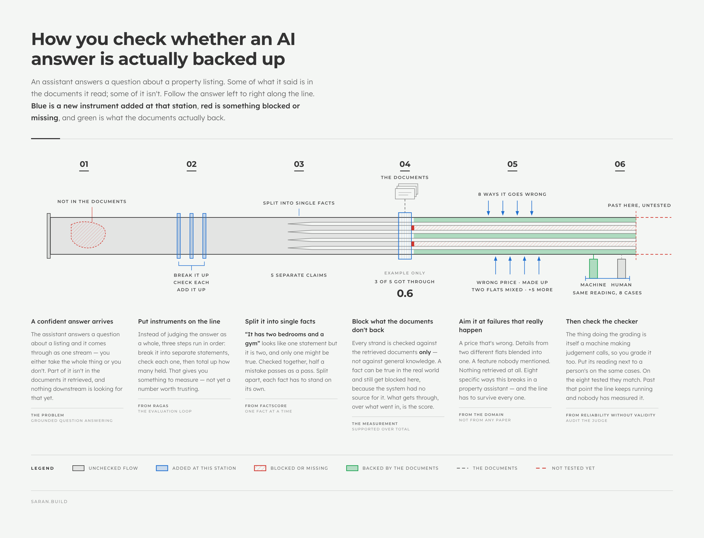
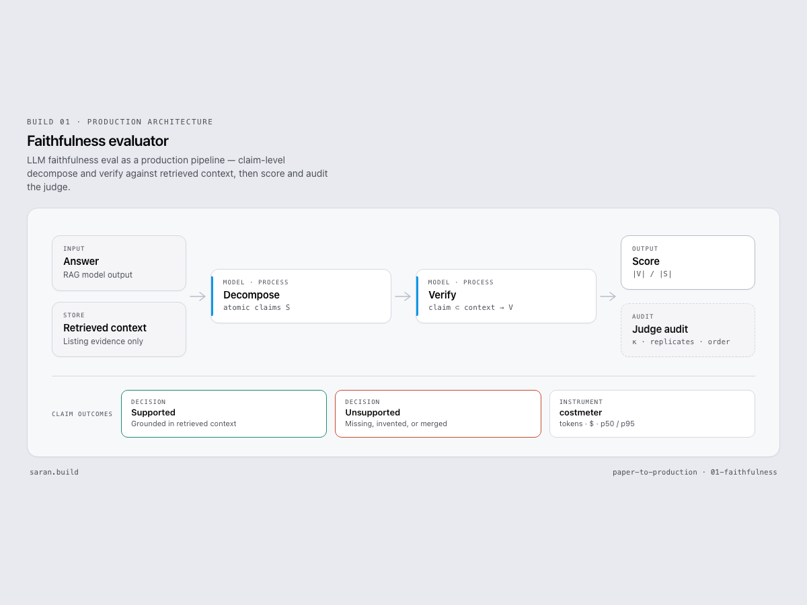

# I built a faithfulness evaluator for a real RAG problem. Here is what the papers actually gave me.

**Slug:** `faithfulness-from-scratch`  
**URL:** `https://saran.build/paper-to-production/faithfulness-from-scratch`  
**Publish:** Tue 4 Aug 2026 · 5:30pm IST  
**Status:** drafting  
**Important:** this version is honest to the repo state on Thursday, July 30, 2026. The larger labelled LLM run is still pending.

---

## The actual problem

I did not start this series because I wanted to “implement RAGAS.”

I started because I have a grounded QA problem: a listing-style RAG system can answer fluently, but I still need to know whether the answer is actually supported by the retrieved context.

That is the applied-engineering version of faithfulness:

> not “does the answer sound right?”
>
> but “are the claims in the answer supported by what the system retrieved?”

For a property or voice assistant use case, wrong prices, invented amenities, and merged facts across listings are not minor errors. They are system failures.

So the job for Build 01 was:

1. build a faithfulness evaluator for a real domain
2. make the failure cases explicit
3. measure the evaluator itself before trusting the metric

### Concept in one picture

*(Concept diagram — the answer as a pipeline: split into single facts, block whatever the documents don't back, then audit the checker itself.)*

---

## What the papers gave me

### RAGAS: the evaluation loop

RAGAS gave me the shape of the evaluator:

1. decompose the answer into claims
2. verify each claim against retrieved context
3. score faithfulness as `supported / total`

That is the useful contribution for an applied engineer: a workable evaluation architecture.

What RAGAS does **not** give you is permission to trust the number automatically.

Faithfulness is about grounding to retrieved context. It is not world truth. If retrieval is wrong, the answer can still look “faithful” to bad context.

### FActScore: claim granularity matters

FActScore’s big lesson is that factuality should be judged at atomic fact level.

That matters immediately in RAG.

If the answer says:

> “Unit 4B is 2BHK and has a gym.”

and only one half is supported, a coarse claim can inflate the score. An atomic split makes the evaluator tell the truth:

- `Unit 4B is 2BHK`
- `Unit 4B has a gym`

One fact can survive while the other fails.

That is not a cosmetic improvement. It changes whether the metric catches the bug.

### Reliability without Validity: audit the judge

The third paper is the one most people skip, and it is the reason this build matters.

If your evaluator uses an LLM judge, exact agreement is not enough. A judge can look stable and still mislead you.

So the evaluator itself needs validation:

- compare against human labels
- report Cohen’s κ, not only exact agreement
- run replicates
- audit order bias

That is how the metric stops being a dashboard ornament and becomes something closer to a control.

---

## What I built in the repo

In this repo, the three papers became one production-shaped evaluator:

- RAGAS became the `decompose -> verify -> score` loop
- FActScore shaped the decomposition discipline
- Reliability without Validity became an MVVP-lite audit path

Repo paths:

- pipeline: [`pipeline.py`](../../builds/01-faithfulness/src/faithfulness/pipeline.py)
- decomposition: [`decompose.py`](../../builds/01-faithfulness/src/faithfulness/decompose.py)
- verification: [`verify.py`](../../builds/01-faithfulness/src/faithfulness/verify.py)
- scoring: [`score.py`](../../builds/01-faithfulness/src/faithfulness/score.py)
- judge audit: [`mvvp.py`](../../builds/01-faithfulness/src/faithfulness/mvvp.py)
- CLI: [`cli.py`](../../builds/01-faithfulness/src/faithfulness/cli.py)

The evaluator is domain-shaped around listing answers, not generic benchmarks.

The current test buckets include:

- fully supported
- partially supported
- contradictory
- correct but unsupported
- poor retrieval
- wrong price or feature
- facts merged across two properties
- empty retrieval

That matters more than “I reproduced the paper” because these are the actual failures a grounded assistant has to survive.

---

## How I used the papers in a real project

The practical mapping is simple:

| Paper | What I took | How I used it |
|---|---|---|
| RAGAS | evaluator loop | built claim-level faithfulness scoring |
| FActScore | atomic fact discipline | split listing answers into smaller claims |
| Reliability without Validity | judge validation protocol | added κ, replicates, and order audit |

This is the part I want people to see.

Applied AI engineering is not:

> “I read three papers and built a clone.”

It is:

> “I extracted the useful parts from three papers, adapted them to a real problem, and built a measurement loop I can actually use.”

---

## Current results from the repo

The current committed results are from the heuristic seed run on **Thursday, July 30, 2026**.

From [`fixture_run.json`](../../builds/01-faithfulness/results/fixture_run.json):

| Metric | Current value |
|---|---|
| Cases | 8 seed fixtures |
| Agreement pairs | 14 claim labels |
| Raw agreement | 1.0 |
| Cohen’s κ | 1.0 |
| Cost / eval | $0.0 in heuristic mode |
| p50 latency | 0.011 ms |
| p95 latency | 0.111 ms |

Case behavior from the same run:

- fully supported answer scored `1.0`
- wrong-price hallucination scored `0.0`
- partially supported answer scored `0.5`
- merged-two-properties case scored `0.333`
- contradictory answer scored `0.0`
- empty retrieval scored `0.0`

From [`mvvp_audit.json`](../../builds/01-faithfulness/results/mvvp_audit.json):

- replicate stability: `1.0`
- mean order disagreement: `0.0`
- paradox flag: `false`

These are good signs for the harness.

They are **not** yet the public claim I would stop at.

Why not?

Because this is still a small heuristic seed set. The repo already calls out the real next milestone:

- run the larger labelled set
- run LLM mode
- compare against human labels at better scale
- report the gap honestly if κ falls

That is the stronger story.

---

## What this build already proves

Even before the larger labelled run, Build 01 proves a few useful things:

1. the evaluator shape works on real listing-style failures
2. the system catches unsupported prices and features
3. the repo has regression fixtures, instrumentation, and an audit command
4. the paper ideas have already been turned into reusable repo artifacts

That is enough to say:

> I did not just read the papers. I turned them into a working evaluator for a real RAG problem.

---

## What is still not proven

This is the part that makes the writeup credible.

I do **not** want to overclaim based on the current seed run.

What is still pending:

- a larger labelled set
- LLM-mode evaluation
- better judge-vs-human validation
- a more realistic cost profile than heuristic mode
- a stronger answer to “would I trust this as a production gate?”

That is exactly why the third paper matters so much.

A metric can look perfect on a small convenient set and still fail the real job.

---

## The applied-engineering takeaway

The main lesson from Build 01 is not “faithfulness matters.”

The stronger lesson is:

> papers gave me the method shape, but the engineering value came from adapting that shape to domain failures and validating the evaluator before trusting the score.

That is the standard I want this repo to follow:

- start from a real problem
- take the usable parts from the papers
- build the system
- measure the system
- say what is still weak

---

## When I would not use this

I would not use this evaluator as a serious production control yet if:

- I only had a tiny seed set and no broader human-labelled audit
- retrieval quality was the main bottleneck and faithfulness was hiding it
- I could not afford the real LLM evaluation path
- I wanted one neat percentage more than I wanted a trustworthy measurement system

And more broadly:

I would not use paper implementations as a signaling trick.

If the paper does not change a real engineering decision, it should stay a note, not become a build.

---

## Decision record

See [ADR-001](../../decisions/ADR-001.md).

**Next:** Build 02 — endpointing and turn-taking latency.

---

## Series

[paper-to-production](https://saran.build/paper-to-production) · [repo](https://github.com/saran-io/paper-to-production)
